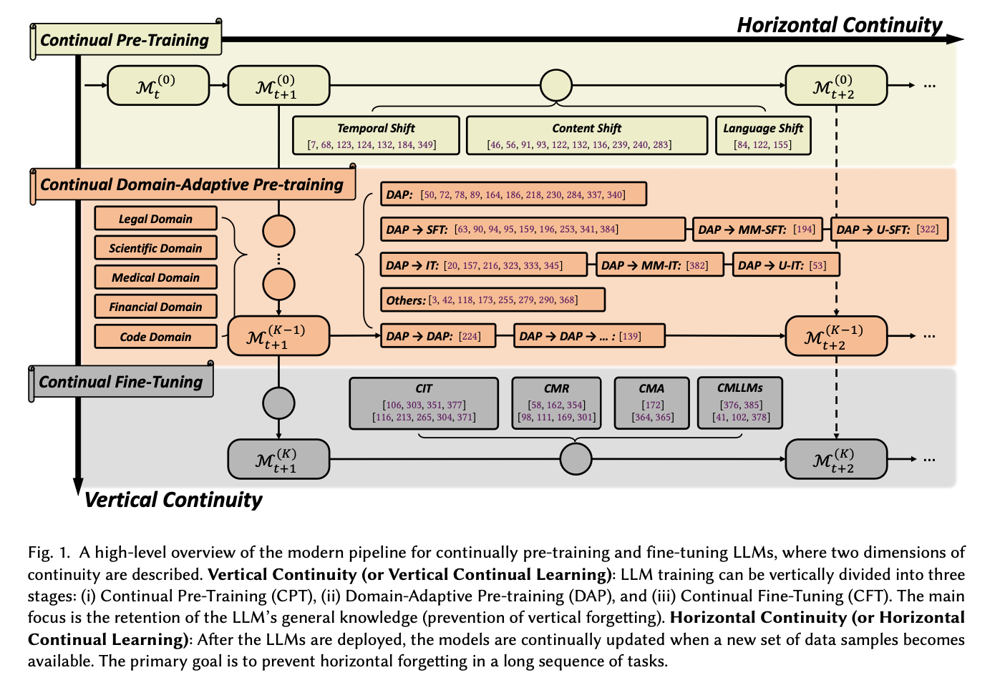

# Continual Learning of Large Language Models: A Comprehensive Survey
This is an updating survey for Continual Learning of Large Language Models (CL-LLMs), a constantly updated and extended version for the manuscript "[Continual Learning of Large Language Models: A Comprehensive Survey](https://arxiv.org/abs/2404.16789)".

***Welcome to contribute to this survey by submitting a pull request or opening an issue!***

<p align="center">

</p>

### Update History
- **[10/2024] (⭐) newpaper: 09/2024 - 10/2024.**
- **[09/2024] (🔥) new papers: 07/2024 - 09/2024.**
- [07/2024] new papers: 06/2024 - 07/2024.
- [07/2024] the [updated version of the paper](https://arxiv.org/abs/2404.16789) has been released on arXiv.
- [06/2024] new papers: 05/2024 - 06/2024.
- [05/2024] new papers: 02/2024 - 05/2024.
- [04/2024] initial release.

### Table of Contents
* [Relevant Survey Papers](#relevant-survey-papers)
* [Continual Pre-Training of LLMs (CPT)](#continual-pre-training-of-llms-cpt)
* [Domain-Adaptive Pre-Training of LLMs (DAP)](#domain-adaptive-pre-training-of-llms-dap)
  * [General Domains](#for-general-domains)
  * [Legal Domain](#legal-domain)
  * [Medical Domain](#medical-domain)
  * [Financial Domain](#financial-domain)
  * [Scientific Domain](#scientific-domain)
  * [Code Domain](#code-domain)
  * [Language Domain](#language-domain)
  * [Other Domains](#other-domains)
* [Continual Fine-Tuning of LLMs (CFT)](#continual-fine-tuning-of-llms-cft)
  * [General Continual Fine-Tuning](#general-continual-fine-tuning)
  * [Continual Instruction Tuning (CIT)](#continual-instruction-tuning-cit)
  * [Continual Model Refinement (CMR)](#continual-model-refinement-cmr)
  * [Continual Model Alignment (CMA)](#continual-model-alignment-cma)
  * [Continual Multimodal LLMs (CMLLMs)](#continual-multimodal-llms-cmllms)
* [Continual LLMs Miscs](#continual-llms-miscs)

## Relevant Survey Papers
- Towards Lifelong Learning of Large Language Models: A Survey [[paper](https://arxiv.org/abs/2406.06391)][[code](https://github.com/qianlima-lab/awesome-lifelong-learning-methods-for-llm)]
- Recent Advances of Foundation Language Models-based Continual Learning: A Survey [[paper](https://arxiv.org/pdf/2405.18653)]
- A Comprehensive Survey of Continual Learning: Theory, Method and Application (TPAMI 2024) [[paper](https://arxiv.org/abs/2302.00487)]
- Continual Learning for Large Language Models: A Survey [[paper](https://arxiv.org/abs/2402.01364)]
- Continual Lifelong Learning in Natural Language Processing: A Survey (COLING 2020) [[paper](https://arxiv.org/abs/2012.09823)]
- Continual Learning of Natural Language Processing Tasks: A Survey [[paper](https://arxiv.org/abs/2211.12701)]
- A Survey on Knowledge Distillation of Large Language Models [[paper](https://arxiv.org/abs/2402.13116)]


## Continual Pre-Training of LLMs (CPT)
- ⭐ Balancing Continuous Pre-Training and Instruction Fine-Tuning: Optimizing Instruction-Following in LLMs [[paper](https://arxiv.org/abs/2410.10739)]
- ⭐ A Learning Rate Path Switching Training Paradigm for Version Updates of Large Language Models [[paper](https://arxiv.org/abs/2410.04103)]
- 🔥 A Practice of Post-Training on Llama-3 70B with Optimal Selection of Additional Language Mixture Ratio [[paper](https://arxiv.org/abs/2409.06624)]
- 🔥 Towards Effective and Efficient Continual Pre-training of Large Language Models [[paper](https://arxiv.org/abs/2407.18743)][[code](https://github.com/RUC-GSAI/Llama-3-SynE)]
- Bilingual Adaptation of Monolingual Foundation Models
 [[paper](https://arxiv.org/abs/2407.12869)]
- Mix-CPT: A Domain Adaptation Framework via Decoupling Knowledge Learning and Format Alignment [[paper](https://arxiv.org/abs/2407.10804)]
- Breaking Language Barriers: Cross-Lingual Continual Pre-Training at Scale [[paper](https://arxiv.org/abs/2407.02118)]
- LLaMA-MoE: Building Mixture-of-Experts from LLaMA with Continual Pre-training [[paper](https://arxiv.org/abs/2406.16554)][[code](https://github.com/pjlab-sys4nlp/llama-moe)]
- Efficient Continual Pre-training by Mitigating the Stability Gap [[paper](https://arxiv.org/abs/2406.14833)][[huggingface](https://huggingface.co/YiDuo1999/Llama-3-Physician-8B-Instruct.)]
- How Do Large Language Models Acquire Factual Knowledge During Pretraining? [[paper](https://arxiv.org/abs/2406.11813)]
- DHA: Learning Decoupled-Head Attention from Transformer Checkpoints via Adaptive Heads Fusion [[paper](https://arxiv.org/abs/2406.06567)]
- MoRA: High-Rank Updating for Parameter-Efficient Fine-Tuning [[paper](https://arxiv.org/abs/2405.12130)][[code](https://github.com/kongds/MoRA)]
- Large Language Model Can Continue Evolving From Mistakes [[paper](https://arxiv.org/abs/2404.08707)]
- Rho-1: Not All Tokens Are What You Need [[paper](https://arxiv.org/abs/2404.07965)][[code](https://github.com/microsoft/rho)]
- Simple and Scalable Strategies to Continually Pre-train Large Language Models [[paper](https://arxiv.org/abs/2403.08763)]
- Investigating Continual Pretraining in Large Language Models: Insights and Implications [[paper](https://arxiv.org/abs/2402.17400)]
- Take the Bull by the Horns: Hard Sample-Reweighted Continual Training Improves LLM Generalization [[paper](https://arxiv.org/abs/2402.14270)][[code](https://github.com/VITA-Group/HardFocusTraining)]
- TimeLMs: Diachronic Language Models from Twitter (ACL 2022, Demo Track) [[paper](https://arxiv.org/abs/2202.03829)][[code](https://github.com/cardiffnlp/timelms)]
- Continual Pre-Training of Large Language Models: How to (re)warm your model? [[paper](https://arxiv.org/abs/2308.04014)]
- Continual Learning Under Language Shift [[paper](https://arxiv.org/abs/2311.01200)]
- Examining Forgetting in Continual Pre-training of Aligned Large Language Models [[paper](https://arxiv.org/abs/2401.03129)]
- Towards Continual Knowledge Learning of Language Models (ICLR 2022) [[paper](https://arxiv.org/abs/2110.03215)][[code](https://github.com/joeljang/continual-knowledge-learning)]
- Lifelong Pretraining: Continually Adapting Language Models to Emerging Corpora (NAACL 2022) [[paper](https://arxiv.org/abs/2110.08534)]
- TemporalWiki: A Lifelong Benchmark for Training and Evaluating Ever-Evolving Language Models (EMNLP 2022) [[paper](https://arxiv.org/abs/2204.14211)][[code](https://github.com/joeljang/temporalwiki)]
- Continual Training of Language Models for Few-Shot Learning (EMNLP 2022) [[paper](https://arxiv.org/abs/2210.05549)][[code](https://github.com/UIC-Liu-Lab/CPT)]
- ERNIE 2.0: A Continual Pre-Training Framework for Language Understanding (AAAI 2020) [[paper](https://arxiv.org/abs/1907.12412)][[code](https://github.com/PaddlePaddle/ERNIE)]
- Dynamic Language Models for Continuously Evolving Content (KDD 2021) [[paper](https://arxiv.org/abs/2106.06297)]
- Continual Pre-Training Mitigates Forgetting in Language and Vision [[paper](https://arxiv.org/abs/2205.09357)][[code](https://github.com/AndreaCossu/continual-pretraining-nlp-vision)]
- DEMix Layers: Disentangling Domains for Modular Language Modeling (NAACL 2022) [[paper](https://arxiv.org/abs/2108.05036)][[code](https://github.com/kernelmachine/demix)]
- Time-Aware Language Models as Temporal Knowledge Bases (TACL 2022) [[paper](https://arxiv.org/abs/2106.15110)]
- Recyclable Tuning for Continual Pre-training (ACL 2023 Findings) [[paper](https://arxiv.org/abs/2305.08702)][[code](https://github.com/thunlp/RecyclableTuning)]
- Lifelong Language Pretraining with Distribution-Specialized Experts (ICML 2023) [[paper](https://arxiv.org/abs/2305.12281)]
- ELLE: Efficient Lifelong Pre-training for Emerging Data (ACL 2022 Findings) [[paper](https://arxiv.org/abs/2203.06311)][[code](https://github.com/thunlp/ELLE)]


## Domain-Adaptive Pre-Training of LLMs (DAP)
### For General Domains
- ⭐ DoPAMine: Domain-specific Pre-training Adaptation from seed-guided data Mining [[paper](https://arxiv.org/abs/2410.00260)]
- 🔥 Amuro & Char: Analyzing the Relationship between Pre-Training and Fine-Tuning of Large Language Models [[paper](https://arxiv.org/abs/2408.06663)]
- CMR Scaling Law: Predicting Critical Mixture Ratios for Continual Pre-training of Language Models [[paper](https://arxiv.org/abs/2407.17467)]
- Task Oriented In-Domain Data Augmentation [[paper](https://arxiv.org/abs/2406.16694)]
- Instruction Pre-Training: Language Models are Supervised Multitask Learners [[paper](https://arxiv.org/abs/2406.14491)][[code](https://github.com/microsoft/LMOps)][[huggingface](https://huggingface.co/instruction-pretrain)]
- D-CPT Law: Domain-specific Continual Pre-Training Scaling Law for Large Language Models [[paper](https://arxiv.org/abs/2406.01375)]
- BLADE: Enhancing Black-box Large Language Models with Small Domain-Specific Models [[paper](https://arxiv.org/abs/2403.18365)]
- Tag-LLM: Repurposing General-Purpose LLMs for Specialized Domains [[paper](https://arxiv.org/abs/2402.05140)]
- Adapting Large Language Models via Reading Comprehension (ICLR 2024) [[paper](https://arxiv.org/abs/2309.09530)][[code](https://github.com/microsoft/LMOps)]

### Legal Domain
- SaulLM-7B: A pioneering Large Language Model for Law [[paper](https://arxiv.org/abs/2403.03883)][[huggingface](https://huggingface.co/papers/2403.03883)]
- Lawyer LLaMA Technical Report [[paper](https://arxiv.org/abs/2305.15062)]

### Medical Domain
- PediatricsGPT: Large Language Models as Chinese Medical Assistants for Pediatric Applications [[paper](https://arxiv.org/abs/2405.19266)]
- Hippocrates: An Open-Source Framework for Advancing Large Language Models in Healthcare [[paper](https://arxiv.org/abs/2404.16621)][[project](https://cyberiada.github.io/Hippocrates/)][[huggingface](https://huggingface.co/emrecanacikgoz)]
- Me LLaMA: Foundation Large Language Models for Medical Applications [[paper](https://arxiv.org/abs/2402.12749)][[code](https://github.com/BIDS-Xu-Lab/Me-LLaMA)]
- BioMedGPT: Open Multimodal Generative Pre-trained Transformer for BioMedicine [[paper](https://arxiv.org/abs/2308.09442)][[code](https://github.com/PharMolix/OpenBioMed)]
- Continuous Training and Fine-tuning for Domain-Specific Language Models in Medical Question Answering [[paper](https://arxiv.org/abs/2311.00204)]
- PMC-LLaMA: Towards Building Open-source Language Models for Medicine [[paper](https://arxiv.org/abs/2304.14454)][[code](https://github.com/chaoyi-wu/PMC-LLaMA)]
- AF Adapter: Continual Pretraining for Building Chinese Biomedical Language Model [[paper](https://arxiv.org/abs/2211.11363)]
- Continual Domain-Tuning for Pretrained Language Models [[paper](https://arxiv.org/abs/2004.02288)]
- HuatuoGPT-II, One-stage Training for Medical Adaption of LLMs [[paper](https://arxiv.org/abs/2311.09774)][[code](https://github.com/FreedomIntelligence/HuatuoGPT-II)]

### Financial Domain
- ⭐ The Construction of Instruction-tuned LLMs for Finance without Instruction Data Using Continual Pretraining and Model Merging [[paper](https://arxiv.org/abs/2409.19854)][[huggingface](https://huggingface.co/pfnet/nekomata-14b-pfn-qfin-inst-merge)]
- 🔥 Open-FinLLMs: Open Multimodal Large Language Models for Financial Applications [[paper](https://arxiv.org/abs/2408.11878)]
- Domain Adaptation of Llama3-70B-Instruct through Continual Pre-Training and Model Merging: A Comprehensive Evaluation [[paper](https://arxiv.org/abs/2406.14971)][[huggingface](https://huggingface.co/arcee-ai/Llama-3-SEC-Base)]
- Construction of Domain-specified Japanese Large Language Model for Finance through Continual Pre-training [[paper](https://arxiv.org/abs/2404.10555)]
- Pretraining and Updating Language- and Domain-specific Large Language Model: A Case Study in Japanese Business Domain [[paper](https://arxiv.org/abs/2404.08262)][[huggingface](https://huggingface.co/stockmark)]
- BBT-Fin: Comprehensive Construction of Chinese Financial Domain Pre-trained Language Model, Corpus and Benchmark [[paper](https://arxiv.org/abs/2302.09432)][[code](https://github.com/ssymmetry/BBT-FinCUGE-Applications)]
- CFGPT: Chinese Financial Assistant with Large Language Model [[paper](https://arxiv.org/abs/2309.10654)][[code](https://github.com/TongjiFinLab/CFGPT)]
- Efficient Continual Pre-training for Building Domain Specific Large Language Models [[paper](https://arxiv.org/abs/2311.08545)]
- WeaverBird: Empowering Financial Decision-Making with Large Language Model, Knowledge Base, and Search Engine [[paper](https://arxiv.org/abs/2308.05361)][[code](https://github.com/ant-research/fin_domain_llm)][[huggingface](https://huggingface.co/weaverbirdllm)][[demo](https://www.youtube.com/watch?v=yofgeqnlrMc)]
- XuanYuan 2.0: A Large Chinese Financial Chat Model with Hundreds of Billions Parameters [[paper](https://arxiv.org/abs/2305.12002)][[huggingface](https://huggingface.co/xyz-nlp/XuanYuan2.0)]

### Scientific Domain
- ⭐ MELT: Materials-aware Continued Pre-training for Language Model Adaptation to Materials Science [[paper](https://arxiv.org/abs/2410.15126)][[code](https://github.com/JunhoKim94/MELT)]
- ⭐ AstroMLab 2: AstroLLaMA-2-70B Model and Benchmarking Specialised LLMs for Astronomy [[paper](https://arxiv.org/abs/2409.19750)][[huggingface](https://huggingface.co/AstroMLab)]
- 🔥 SciLitLLM: How to Adapt LLMs for Scientific Literature Understanding [[paper](https://arxiv.org/abs/2408.15545)]
- PRESTO: Progressive Pretraining Enhances Synthetic Chemistry Outcomes [[paper](https://arxiv.org/abs/2406.13193)][[code](https://github.com/IDEA-XL/PRESTO)]
- ClimateGPT: Towards AI Synthesizing Interdisciplinary Research on Climate Change [[paper](https://arxiv.org/abs/2401.09646)][[hugginface](https://huggingface.co/collections/eci-io/climategpt-65a83cd8a92d5908dfffc849)]
- AstroLLaMA: Towards Specialized Foundation Models in Astronomy [[paper](https://arxiv.org/abs/2309.06126)]
- OceanGPT: A Large Language Model for Ocean Science Tasks [[paper](https://arxiv.org/abs/2310.02031)][[code](https://github.com/zjunlp/KnowLM)]
- K2: A Foundation Language Model for Geoscience Knowledge Understanding and Utilization [[paper](https://arxiv.org/abs/2306.05064)][[code](https://github.com/davendw49/k2)][[huggingface](https://huggingface.co/daven3/k2-v1)]
- MarineGPT: Unlocking Secrets of "Ocean" to the Public [[paper](https://arxiv.org/abs/2310.13596)][[code](https://github.com/hkust-vgd/MarineGPT)]
- GeoGalactica: A Scientific Large Language Model in Geoscience [[paper](https://arxiv.org/abs/2401.00434)][[code](https://github.com/geobrain-ai/geogalactica)][[huggingface](https://huggingface.co/papers/2401.00434)]
- Llemma: An Open Language Model For Mathematics [[paper](https://arxiv.org/abs/2310.10631)][[code](https://github.com/EleutherAI/math-lm)][[huggingface](https://huggingface.co/EleutherAI/llemma_34b)]
- PLLaMa: An Open-source Large Language Model for Plant Science [[paper](https://arxiv.org/abs/2401.01600)][[code](https://github.com/Xianjun-Yang/PLLaMa)][[huggingface](https://huggingface.co/papers/2401.01600)]

### Code Domain
- CodeGen: An Open Large Language Model for Code with Multi-Turn Program Synthesis [[paper](https://arxiv.org/abs/2203.13474)][[code](https://github.com/salesforce/CodeGen)][[huggingface](https://huggingface.co/models?search=salesforce+codegen)]
- Code Needs Comments: Enhancing Code LLMs with Comment Augmentation [[code](https://arxiv.org/abs/2402.13013)]
- StarCoder: may the source be with you! [[ppaer](https://arxiv.org/abs/2305.06161)][[code](https://github.com/bigcode-project/starcoder)]
- DeepSeek-Coder: When the Large Language Model Meets Programming -- The Rise of Code Intelligence [[paper](https://arxiv.org/abs/2401.14196)][[code](https://github.com/deepseek-ai/DeepSeek-Coder)][[huggingface](https://huggingface.co/deepseek-ai)]
- IRCoder: Intermediate Representations Make Language Models Robust Multilingual Code Generators [[paper](https://arxiv.org/abs/2403.03894)][[code](https://github.com/UKPLab/arxiv2024-ircoder)]
- Code Llama: Open Foundation Models for Code [[paper](https://arxiv.org/abs/2308.12950)][[code]( https://github.com/facebookresearch/codellama)]

### Language Domain
- 🔥 RedWhale: An Adapted Korean LLM Through Efficient Continual Pretraining [[paper](https://arxiv.org/abs/2408.11294)]
- Unlocking the Potential of Model Merging for Low-Resource Languages
 [[paper](https://arxiv.org/abs/2407.03994)]
- Mitigating Catastrophic Forgetting in Language Transfer via Model Merging [[paper](https://arxiv.org/abs/2407.08699)]
- Enhancing Translation Accuracy of Large Language Models through Continual Pre-Training on Parallel Data [[paper](https://arxiv.org/abs/2407.03145)]
- BAMBINO-LM: (Bilingual-)Human-Inspired Continual Pretraining of BabyLM [[paper](https://arxiv.org/abs/2406.11418)]
- InstructionCP: A fast approach to transfer Large Language Models into target language [[paper](https://arxiv.org/abs/2405.20175)]
- Continual Pre-Training for Cross-Lingual LLM Adaptation: Enhancing Japanese Language Capabilities [[paper](https://arxiv.org/abs/2404.17790)]
- Sailor: Open Language Models for South-East Asia [[paper](https://arxiv.org/abs/2404.03608)][[code](https://github.com/sail-sg/sailor-llm)]
- Aurora-M: The First Open Source Multilingual Language Model Red-teamed according to the U.S. Executive Order [[paper](https://arxiv.org/abs/2404.00399)][[huggingface](https://huggingface.co/collections/aurora-m/aurora-m-models-65fdfdff62471e09812f5407)]

### Other Domains
- LLaMA Pro: Progressive LLaMA with Block Expansion [[paper](https://arxiv.org/abs/2401.02415)][[code](https://github.com/TencentARC/LLaMA-Pro)][[huggingface](https://huggingface.co/TencentARC/LLaMA-Pro-8B)]
- ECONET: Effective Continual Pretraining of Language Models for Event Temporal Reasoning [[paper](https://arxiv.org/abs/2012.15283)][[code](https://github.com/PlusLabNLP/ECONET)]
- Pre-training Text-to-Text Transformers for Concept-centric Common Sense [[paper](https://arxiv.org/abs/2011.07956)][[code](https://github.com/INK-USC/CALM/)][[project](https://inklab.usc.edu/calm-project/)]
- Don't Stop Pretraining: Adapt Language Models to Domains and Tasks (ACL 2020) [[paper](https://arxiv.org/abs/2004.10964)][[code](https://github.com/allenai/dont-stop-pretraining)]
- EcomGPT-CT: Continual Pre-training of E-commerce Large Language Models with Semi-structured Data [[paper](https://arxiv.org/abs/2312.15696)]

## Continual Fine-Tuning of LLMs (CFT)

### General Continual Fine-Tuning
- ⭐ Preserving Generalization of Language models in Few-shot Continual Relation Extraction [[paper](https://arxiv.org/abs/2410.00334)]
- 🔥 MoFO: Momentum-Filtered Optimizer for Mitigating Forgetting in LLM Fine-Tuning [[paper](https://arxiv.org/abs/2407.20999)]
- Learn it or Leave it: Module Composition and Pruning for Continual Learning [[paper](https://arxiv.org/abs/2406.18708)]
- Unlocking Continual Learning Abilities in Language Models [[paper](https://arxiv.org/abs/2406.17245)][[code](https://github.com/wenyudu/MIGU)]
- Achieving Forgetting Prevention and Knowledge Transfer in Continual Learning (NeurIPS 2021) [[paper](https://arxiv.org/abs/2112.02706)][[code](https://github.com/ZixuanKe/PyContinual)]
- Can BERT Refrain from Forgetting on Sequential Tasks? A Probing Study (ICLR 2023) [[paper](https://arxiv.org/abs/2303.01081)][[code](https://github.com/kobayashikanna01/plms_are_lifelong_learners)]
- CIRCLE: Continual Repair across Programming Languages (ISSTA 2022) [[paper](https://arxiv.org/abs/2205.10956)]
- ConPET: Continual Parameter-Efficient Tuning for Large Language Models [[paper](https://arxiv.org/abs/2309.14763)][[code](https://github.com/Raincleared-Song/ConPET)]
- Enhancing Continual Learning with Global Prototypes: Counteracting Negative Representation Drift [[paper](https://arxiv.org/abs/2205.12186)]
- Investigating Forgetting in Pre-Trained Representations Through Continual Learning [[paper](https://arxiv.org/abs/2305.05968)]
- Learn or Recall? Revisiting Incremental Learning with Pre-trained Language Models [[paper](https://arxiv.org/abs/2312.07887)][[code](https://github.com/zzz47zzz/pretrained-lm-for-incremental-learning)]
- LFPT5: A Unified Framework for Lifelong Few-shot Language Learning Based on Prompt Tuning of T5 (ICLR 2022) [[paper](https://arxiv.org/abs/2110.07298)][[code](https://github.com/qcwthu/Lifelong-Fewshot-Language-Learning)]
- On the Usage of Continual Learning for Out-of-Distribution Generalization in Pre-trained Language Models of Code [[paper](https://arxiv.org/abs/2305.04106)]
- Overcoming Catastrophic Forgetting in Massively Multilingual Continual Learning (ACL 2023 Findings) [[paper](https://arxiv.org/abs/2305.16252)]
- Parameterizing Context: Unleashing the Power of Parameter-Efficient Fine-Tuning and In-Context Tuning for Continual Table Semantic Parsing (NeurIPS 2023) [[paper](https://arxiv.org/abs/2310.04801)][[code](https://github.com/KSESEU/C3)]

### Continual Instruction Tuning (CIT)
- Fine-tuned Language Models are Continual Learners [[paper](https://arxiv.org/pdf/2205.12393.pdf)][[code](https://github.com/ThomasScialom/T0_continual_learning)]
- TRACE: A Comprehensive Benchmark for Continual Learning in Large Language Models [[paper](https://arxiv.org/pdf/2310.06762.pdf)][[code](https://github.com/BeyonderXX/TRACE)]
- Large-scale Lifelong Learning of In-context Instructions and How to Tackle It [[paper](https://aclanthology.org/2023.acl-long.703.pdf)]
- CITB: A Benchmark for Continual Instruction Tuning [[paper](https://arxiv.org/pdf/2310.14510.pdf)][[code](https://github.com/hyintell/CITB)]
- Mitigating Catastrophic Forgetting in Large Language Models with Self-Synthesized Rehearsal [[paper](https://arxiv.org/pdf/2403.01244.pdf)]
- Don't Half-listen: Capturing Key-part Information in Continual Instruction Tuning [[paper](https://arxiv.org/pdf/2403.10056.pdf)]
- ConTinTin: Continual Learning from Task Instructions [[paper](https://arxiv.org/pdf/2203.08512.pdf)]
- Orthogonal Subspace Learning for Language Model Continual Learning [[paper](https://arxiv.org/pdf/2310.14152.pdf)][[code](https://github.com/cmnfriend/O-LoRA)]
- SAPT: A Shared Attention Framework for Parameter-Efficient Continual Learning of Large Language Models [[paper](https://arxiv.org/pdf/2401.08295.pdf)]
- InsCL: A Data-efficient Continual Learning Paradigm for Fine-tuning Large Language Models with Instructions [[paper](https://arxiv.org/pdf/2403.11435.pdf)]

### Continual Model Refinement (CMR)
- ⭐ UniAdapt: A Universal Adapter for Knowledge Calibration [[paper](https://arxiv.org/abs/2410.00454)]
- LEMoE: Advanced Mixture of Experts Adaptor for Lifelong Model Editing of Large Language Models [[paper](https://arxiv.org/abs/2406.20030)]
- WISE: Rethinking the Knowledge Memory for Lifelong Model Editing of Large Language Models [[paper](https://arxiv.org/abs/2405.14768)][[code](https://github.com/zjunlp/EasyEdit)]
- Aging with GRACE: Lifelong Model Editing with Discrete Key-Value Adaptors [[paper](https://arxiv.org/pdf/2211.11031.pdf)][[code](https://github.com/thartvigsen/grace)]
- On Continual Model Refinement in Out-of-Distribution Data Streams [[paper](https://arxiv.org/pdf/2205.02014.pdf)][[code](https://github.com/facebookresearch/cmr)][[project](https://cmr-nlp.github.io/)]
- Melo: Enhancing model editing with neuron-indexed dynamic lora [[paper](https://arxiv.org/pdf/2312.11795.pdf)][[code](https://github.com/ECNU-ICALK/MELO)]
- Larimar: Large language models with episodic memory control [[paper](https://arxiv.org/pdf/2403.11901.pdf)]
- Wilke: Wise-layer knowledge editor for lifelong knowledge editing [[paper](https://arxiv.org/pdf/2402.10987.pdf)]


### Continual Model Alignment (CMA)
- Mind the Interference: Retaining Pre-trained Knowledge in Parameter Efficient Continual Learning of Vision-Language Models [[paper](https://arxiv.org/abs/2407.05342)]
- Online Merging Optimizers for Boosting Rewards and Mitigating Tax in Alignment [[paper](https://arxiv.org/abs/2405.17931)][[code](https://github.com/QwenLM/online_merging_optimizers)]
- Alpaca: A Strong, Replicable Instruction-Following Model [[project](https://crfm.stanford.edu/2023/03/13/alpaca.html)] [[code](https://github.com/tatsu-lab/stanford_alpaca)]
- Self-training Improves Pre-training for Few-shot Learning in Task-oriented Dialog Systems [[paper](https://arxiv.org/pdf/2108.12589.pdf)] [[code](https://github.com/MiFei/ST-ToD)]
- Training language models to follow instructions with human feedback (NeurIPS 2022) [[paper](https://proceedings.neurips.cc/paper_files/paper/2022/file/b1efde53be364a73914f58805a001731-Paper-Conference.pdf)]
- Direct preference optimization: Your language model is secretly a reward model (NeurIPS 2023) [[paper](https://proceedings.neurips.cc/paper_files/paper/2023/file/a85b405ed65c6477a4fe8302b5e06ce7-Paper-Conference.pdf)]
- Copf: Continual learning human preference through optimal policy fitting [[paper](https://arxiv.org/pdf/2310.15694)]
- CPPO: Continual Learning for Reinforcement Learning with Human Feedback (ICLR 2024) [[paper](https://openreview.net/pdf?id=86zAUE80pP)]
- A Moral Imperative: The Need for Continual Superalignment of Large Language Models [[paper](https://arxiv.org/pdf/2403.14683)]
- Mitigating the Alignment Tax of RLHF [[paper](https://arxiv.org/abs/2309.06256)]

### Continual Multimodal LLMs (CMLLMs)
- ⭐ ATLAS: Adapter-Based Multi-Modal Continual Learning with a Two-Stage Learning Strategy [[paper](https://arxiv.org/abs/2410.10923)][[code](https://github.com/lihong2303/ATLAS)]
- ⭐ Model Developmental Safety: A Safety-Centric Method and Applications in Vision-Language Models [[paper](https://arxiv.org/abs/2410.03955)][[code](https://github.com/GangLii/DevSafety)]
- CLIP with Generative Latent Replay: a Strong Baseline for Incremental Learning [[paper](https://arxiv.org/abs/2407.15793)]
- Continually Learn to Map Visual Concepts to Large Language Models in Resource-constrained Environments [[paper](https://arxiv.org/abs/2407.08279)]
- Mind the Interference: Retaining Pre-trained Knowledge in Parameter Efficient Continual Learning of Vision-Language Models [[paper](https://arxiv.org/abs/2407.05342)]
- CLIP model is an Efficient Online Lifelong Learner [[paper](https://arxiv.org/abs/2405.15155)]
- CLAP4CLIP: Continual Learning with Probabilistic Finetuning for Vision-Language Models [[paper](https://arxiv.org/abs/2403.19137)][[code](https://github.com/srvCodes/clap4clip)]
- Boosting Continual Learning of Vision-Language Models via Mixture-of-Experts Adapters (CVPR 2024) [[paper](https://arxiv.org/abs/2403.11549)][[code](https://github.com/JiazuoYu/MoE-Adapters4CL)]
- CoLeCLIP: Open-Domain Continual Learning via Joint Task Prompt and Vocabulary Learning [[paper](https://arxiv.org/abs/2403.10245)]
- Select and Distill: Selective Dual-Teacher Knowledge Transfer for Continual Learning on Vision-Language Models [[paper](https://arxiv.org/abs/2403.09296)]
- Investigating the Catastrophic Forgetting in Multimodal Large Language Models (PMLR 2024) [[paper](https://arxiv.org/abs/2309.10313)]
- MiniGPT-4: Enhancing Vision-Language Understanding with Advanced Large Language Models [[paper](https://arxiv.org/abs/2304.10592)] [[code](https://github.com/Vision-CAIR/MiniGPT-4)]
- Visual Instruction Tuning (NeurIPS 2023, Oral) [[paper](https://arxiv.org/abs/2304.08485)] [[code](https://github.com/haotian-liu/LLaVA)]
- Continual Instruction Tuning for Large Multimodal Models [[paper](https://arxiv.org/abs/2311.16206)]
- CoIN: A Benchmark of Continual Instruction tuNing for Multimodel Large Language Model [[paper](https://arxiv.org/abs/2403.08350)] [[code](https://github.com/zackschen/coin)]
- Model Tailor: Mitigating Catastrophic Forgetting in Multi-modal Large Language Models [[paper](https://arxiv.org/abs/2402.12048)]
- Reconstruct before Query: Continual Missing Modality Learning with Decomposed Prompt Collaboration [[paper](https://arxiv.org/abs/2403.11373)] [[code](https://github.com/Tree-Shu-Zhao/RebQ.pytorch)]

## Continual LLMs Miscs
- ⭐ Scalable Data Ablation Approximations for Language Models through Modular Training and Merging [[paper](https://arxiv.org/abs/2410.15661)]
- How Do Large Language Models Acquire Factual Knowledge During Pretraining? [[paper](https://arxiv.org/abs/2406.11813)]
- Data Mixing Laws: Optimizing Data Mixtures by Predicting Language Modeling Performance [[paper](https://arxiv.org/abs/2403.16952)][[code](https://github.com/yegcjs/mixinglaws)]
- Evaluating the External and Parametric Knowledge Fusion of Large Language Models [[paper](https://arxiv.org/abs/2405.19010)]
- Demystifying Forgetting in Language Model Fine-Tuning with Statistical Analysis of Example Associations [[paper](https://arxiv.org/abs/2406.14026)]
- AdapterSwap: Continuous Training of LLMs with Data Removal and Access-Control Guarantees [[paper](https://arxiv.org/abs/2404.08417)]
- COPAL: Continual Pruning in Large Language Generative Models [[paper](https://arxiv.org/abs/2405.02347)]
- HippoRAG: Neurobiologically Inspired Long-Term Memory for Large Language Models [[paper](https://arxiv.org/abs/2405.14831)][[code](https://github.com/OSU-NLP-Group/HippoRAG)]
- Reawakening knowledge: Anticipatory recovery from catastrophic interference via structured training [[paper](https://arxiv.org/abs/2403.09613)][[code](https://github.com/Agentic-Learning-AI-Lab/anticipatory-recovery-public)]

## Reference
If you find our survey or this collection of papers useful, please consider citing our work by
```bib
@article{shi2024continual,
  title={Continual Learning of Large Language Models: A Comprehensive Survey},
  author={Shi, Haizhou and 
          Xu, Zihao and 
          Wang, Hengyi and 
          Qin, Weiyi and 
          Wang, Wenyuan and 
          Wang, Yibin and 
          Wang, Zifeng and 
          Ebrahimi, Sayna and 
          Wang, Hao},
  journal={arXiv preprint arXiv:2404.16789},
  year={2024}
}
```
